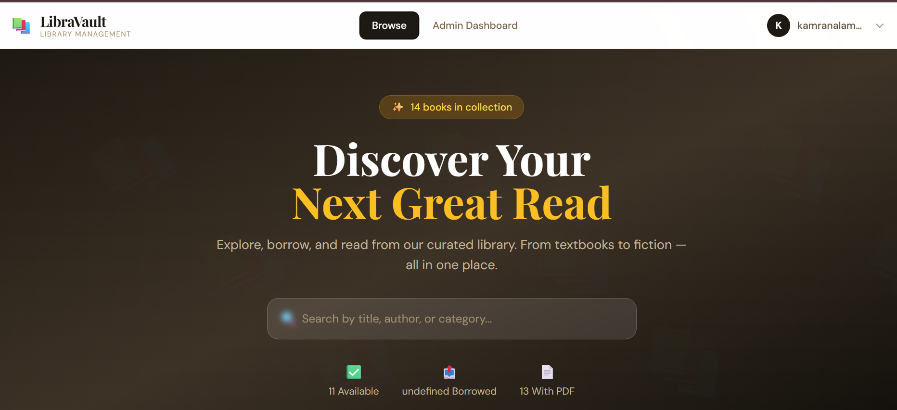
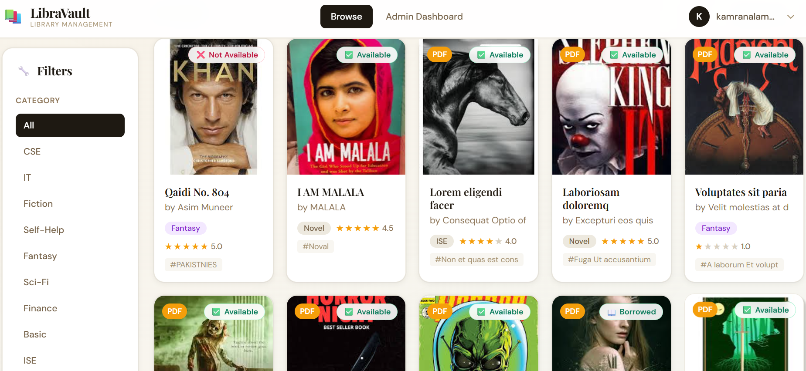
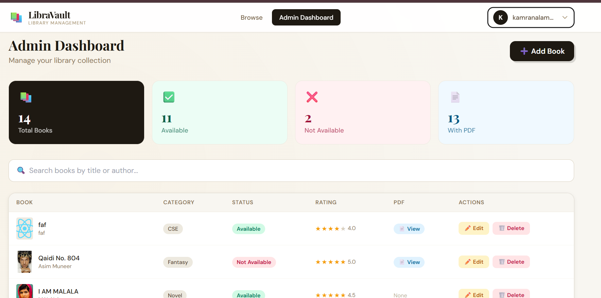

# 📚 LibraVault — Advanced Library Management System v2.0

A fully advanced, production-grade library management system built with **React 18 + Vite 5 + Firebase + Tailwind CSS**. LibraVault offers a highly interactive user experience with real-time database updates, comprehensive book search & filtering, and a powerful admin control system.

---

## 📸 App Preview & Screenshots

Here is a visual walk-through of LibraVault's key interfaces:

### 🏠 Home Page (Hero Section)
Explore your next favorite book with live statistics and a smart universal search bar.


### 📚 Book Grid & Filter Panel
Browse our collection through a responsive card grid, and narrow down search results using categories, rating levels, and availability statuses.


### 🛠️ Admin Dashboard
Complete control center for managing books, uploading PDFs/covers, tracking real-time statistics, and handling records directly from the UI.


---

## ✨ Features

### 🔐 Authentication
- Email/Password Sign Up & Sign In
- Google OAuth Sign In
- Password Reset via email
- Protected routes for admin

### 📚 Library Features
- Browse all books with beautiful card grid
- **Advanced Filtering** — Category, Status (Available/Borrowed/Coming Soon), Min Rating, PDF-only
- **Sorting** — Newest, Oldest, Title A–Z, Top Rated
- Search by title, author, or category
- Pagination (15 books/page)
- Real-time updates via Firebase

### 📖 Book Details
- Book detail modal with tabs: Info, Reviews, Read PDF
- Read PDF directly in browser (iframe viewer)
- Download PDF button
- Star rating display
- Tags, availability, copies info

### ⭐ Reviews System
- Logged-in users can add star ratings + comments
- Auto-recalculates average rating

### 🛠️ Admin Dashboard (All logged-in users in demo mode)
- Stats overview (total, available, borrowed, with PDF)
- Add, Edit, Delete books
- Upload cover image (file or URL)
- Upload PDF (stored in Firebase Storage)
- Inline table management

### 🎨 Design
- Playfair Display + DM Sans fonts
- Warm ink/amber color palette
- Smooth animations and transitions
- Fully responsive (mobile + desktop)
- Sticky navbar with user dropdown

---

## 🚀 Setup & Installation

### 1. Install Dependencies
```bash
npm install
```

### 2. Firebase Setup
The app is pre-configured with your Firebase project. Make sure these are enabled in Firebase Console:
- **Authentication** → Email/Password + Google providers
- **Realtime Database** → Set rules to allow read/write for authenticated users
- **Storage** → Enable for PDF and cover image uploads

**Recommended Firebase Rules (Realtime Database):**
```json
{
  "rules": {
    "books": {
      ".read": true,
      ".write": "auth != null"
    }
  }
}
```

**Firebase Storage Rules:**
```
rules_version = '2';
service firebase.storage {
  match /b/{bucket}/o {
    match /{allPaths=**} {
      allow read: if true;
      allow write: if request.auth != null;
    }
  }
}
```

### 3. Run Development Server
```bash
npm run dev
```

### 4. Build for Production
```bash
npm run build
```

---

## 📁 Project Structure

Feel free to browse through the key project files:

- **Source Code (`src/`):**
  - **Components:**
    - [src/components/Navbar.jsx](file:///d:/6th%20Sem/SRE/Project%20files/library-v5-final/library-v5/src/components/Navbar.jsx) — Sticky header with authentication states.
    - [src/components/Footer.jsx](file:///d:/6th%20Sem/SRE/Project%20files/library-v5-final/library-v5/src/components/Footer.jsx) — Rich footer with navigation & info.
    - [src/components/BookGrid.jsx](file:///d:/6th%20Sem/SRE/Project%20files/library-v5-final/library-v5/src/components/BookGrid.jsx) — Grid system displaying book cards dynamically.
    - [src/components/BookDetailModal.jsx](file:///d:/6th%20Sem/SRE/Project%20files/library-v5-final/library-v5/src/components/BookDetailModal.jsx) — Detailed overlay featuring reviews and integrated PDF reader.
    - [src/components/BookFormModal.jsx](file:///d:/6th%20Sem/SRE/Project%20files/library-v5-final/library-v5/src/components/BookFormModal.jsx) — Modal form for adding/editing library assets.
    - [src/components/FilterPanel.jsx](file:///d:/6th%20Sem/SRE/Project%20files/library-v5-final/library-v5/src/components/FilterPanel.jsx) — Responsive sidebar containing filters.
    - [src/components/StarRating.jsx](file:///d:/6th%20Sem/SRE/Project%20files/library-v5-final/library-v5/src/components/StarRating.jsx) — Reusable rating system indicator.
  - **Contexts & Config:**
    - [src/context/AuthContext.jsx](file:///d:/6th%20Sem/SRE/Project%20files/library-v5-final/library-v5/src/context/AuthContext.jsx) — User context management.
    - [src/firebase/config.js](file:///d:/6th%20Sem/SRE/Project%20files/library-v5-final/library-v5/src/firebase/config.js) — Firebase API and services settings.
  - **Custom Hooks:**
    - [src/hooks/useBooks.js](file:///d:/6th%20Sem/SRE/Project%20files/library-v5-final/library-v5/src/hooks/useBooks.js) — Book fetching, database CRUD hooks, and uploads.
  - **Pages:**
    - [src/pages/AuthPage.jsx](file:///d:/6th%20Sem/SRE/Project%20files/library-v5-final/library-v5/src/pages/AuthPage.jsx) — Authentication interfaces.
    - [src/pages/HomePage.jsx](file:///d:/6th%20Sem/SRE/Project%20files/library-v5-final/library-v5/src/pages/HomePage.jsx) — Standard user dashboard containing library grid.
    - [src/pages/AdminDashboard.jsx](file:///d:/6th%20Sem/SRE/Project%20files/library-v5-final/library-v5/src/pages/AdminDashboard.jsx) — Restricted dashboard panel for library management.
  - **Router & Main Entry:**
    - [src/App.jsx](file:///d:/6th%20Sem/SRE/Project%20files/library-v5-final/library-v5/src/App.jsx) — Route declarations.
    - [src/main.jsx](file:///d:/6th%20Sem/SRE/Project%20files/library-v5-final/library-v5/src/main.jsx) — Direct React application mount.

- **Setup & Config Guides:**
  - [ADMIN_SETUP.md](file:///d:/6th%20Sem/SRE/Project%20files/library-v5-final/library-v5/ADMIN_SETUP.md) — Step-by-step guide to configure administrative accounts.
  - [CLOUDINARY_SETUP.md](file:///d:/6th%20Sem/SRE/Project%20files/library-v5-final/library-v5/CLOUDINARY_SETUP.md) — Free hosting configuration for media storage (covers and PDFs).

---

## 🔧 Tech Stack
- **React 18** + **Vite 5**
- **Firebase 10** (Realtime DB + Auth + Storage)
- **Tailwind CSS 3** — Utility-first styling
- **React Router 6** — Client-side routing
- **react-hot-toast** — Toast notifications
